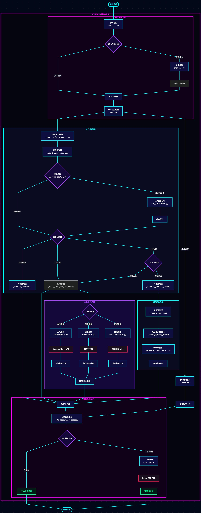

# MCP智能助手

基于Model-Control-Protocol（MCP）和大型语言模型构建的智能助手系统，支持多种工具调用和自然语言交互。

## 项目概述

MCP智能助手是一个集成了自然语言理解、意图识别和多种外部工具的智能对话系统。它能够通过语音或文本输入与用户交互，理解用户的意图，并通过调用相应的工具来提供信息和服务。

主要功能包括：
- 天气查询功能：可以查询指定城市的天气状况
- 周边搜索功能：可以查询周边的餐饮、购物、娱乐等信息
- 商品查询功能：可以在虚拟商场数据库中查询商品信息
- 自然语言对话：支持常规的聊天和问答功能

## 技术架构

项目采用模块化设计，核心组件包括：

- **状态管理器**：维护全局上下文和会话状态
- **对话管理器**：处理对话历史和消息格式化
- **意图识别器**：识别用户意图并提取关键实体
- **工具路由器**：基于意图选择并调用合适的工具
- **语言模型接口**：与大型语言模型进行交互
- **工具模块**：提供各种专业服务的可扩展工具集

## 项目结构

```
mcp-client/
├── main.py                  # 应用入口点
├── chat_ui.py               # 聊天用户界面
├── .env                     # 环境变量配置
├── pyproject.toml           # 项目配置文件
├── uv.lock                  # uv依赖锁定文件
├── .python-version          # Python版本配置
├── core/                    # 核心服务层
│   ├── conversation_manager.py  # 对话管理
│   ├── intent_recognizer.py     # 意图识别
│   ├── state_manager.py         # 状态管理
│   ├── tool_router.py           # 工具协调
│   ├── llm_interface.py         # 语言模型接口
│   └── intent_cache.py          # 意图缓存
├── tools/                   # 工具服务层
│   ├── weatherMCP.py        # 天气查询工具
│   ├── areaSearchMCP.py     # 周边搜索工具
│   └── marketMCP.py         # 商场商品工具
├── config/                  # 配置文件目录
├── data/                    # 数据文件目录
├── diagrams/                # 架构图目录
├── images/                  # 图片资源目录
├── tests/                   # 测试文件
│   ├── test_core.py         # 核心模块测试
│   └── test_tool_router.py  # 工具路由测试
└── build/                   # 构建目录
    └── mcp_client.egg-info/ # Python包信息
```

## 功能特点

### 1. 自然语言理解
- 基于大型语言模型的意图识别
- 上下文感知的对话管理
- 实体提取和参数解析

### 2. 工具调用
- **天气查询**：通过OpenWeather API获取城市天气信息
- **周边搜索**：利用高德地图API搜索周边兴趣点
- **商品查询**：查询虚拟商场数据库中的商品信息

### 3. 用户界面
- 文本聊天界面
- 语音输入支持（基于whisper模型）
- 异步响应处理

## 安装与设置

### 前置需求
- Python 3.9+
- uv包管理器
- Ollama服务（可选，用于本地LLM）

### 环境设置
1. 克隆仓库
```bash
git clone https://github.com/yourusername/mcp-client.git
cd mcp-client
```

2. 使用uv创建虚拟环境
```bash
uv venv
```

3. 安装依赖
```bash
uv pip install -e .
```

4. 配置API密钥
创建`.env`文件并添加以下内容：
```
# OpenAI API密钥（用于语言模型）
OPENAI_API_KEY=your_openai_api_key

# OpenWeather API密钥（用于天气查询）
OPENWEATHER_API_KEY=your_openweather_api_key

# 高德地图API密钥（用于周边搜索）
AMAP_API_KEY=your_amap_api_key

# ollama config
BASE_URL=http://localhost:11434/v1/
MODEL="qwen2.5-coder:14b"
OPENAI_API_KEY=ollama
```

注意：您需要先注册相应的API服务并获取API密钥：
- OpenWeather API: https://openweathermap.org/api
- 高德地图API: https://lbs.amap.com/

## 使用方法

1. 按上述配置好虚拟环境
2. 启动应用

以下是MCP智能助手的系统介绍：

<div align="center">
  
  <p>图1：MCP智能助手工作序列</p>
</div>

<div align="center">
  
  <p>图2：MCP智能助手结构图</p>
</div>

<div align="center">
  
  <p>图3：MCP智能助手UML图</p>
</div>

<div align="center">
  
  <p>图4：MCP智能助手工作流程图</p>
</div>
